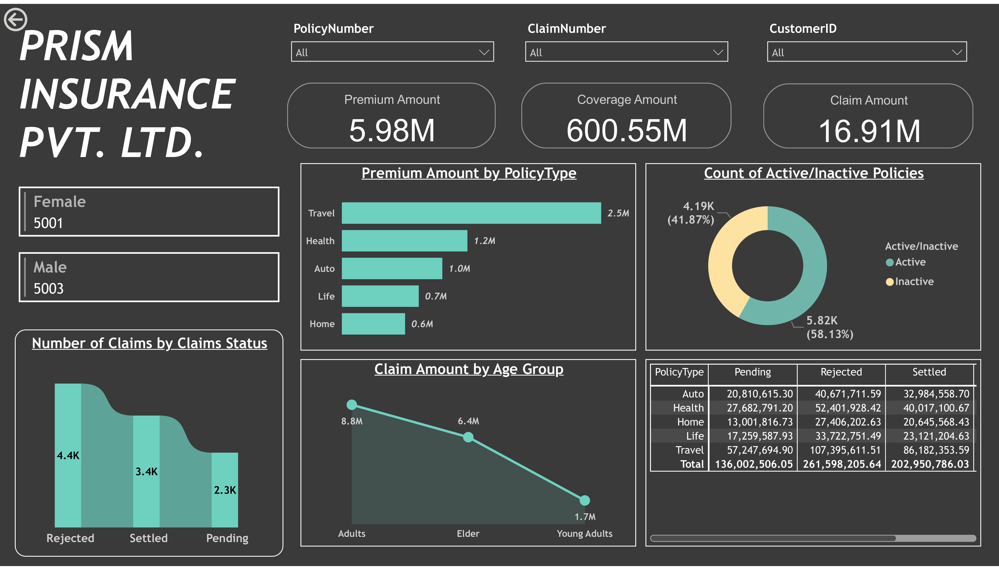
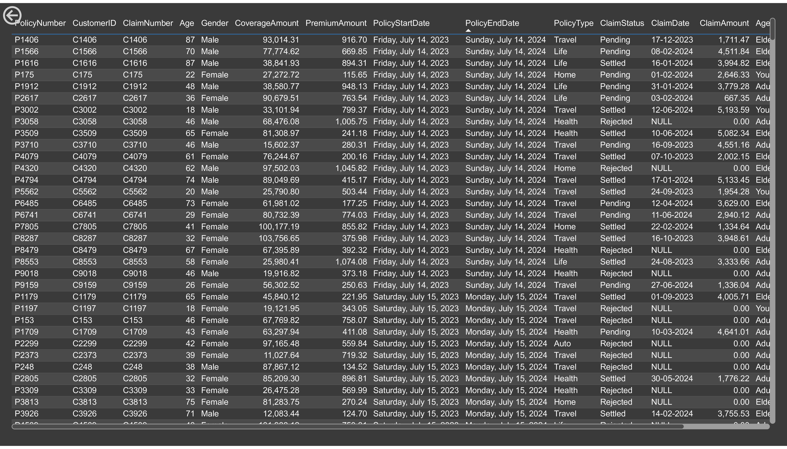
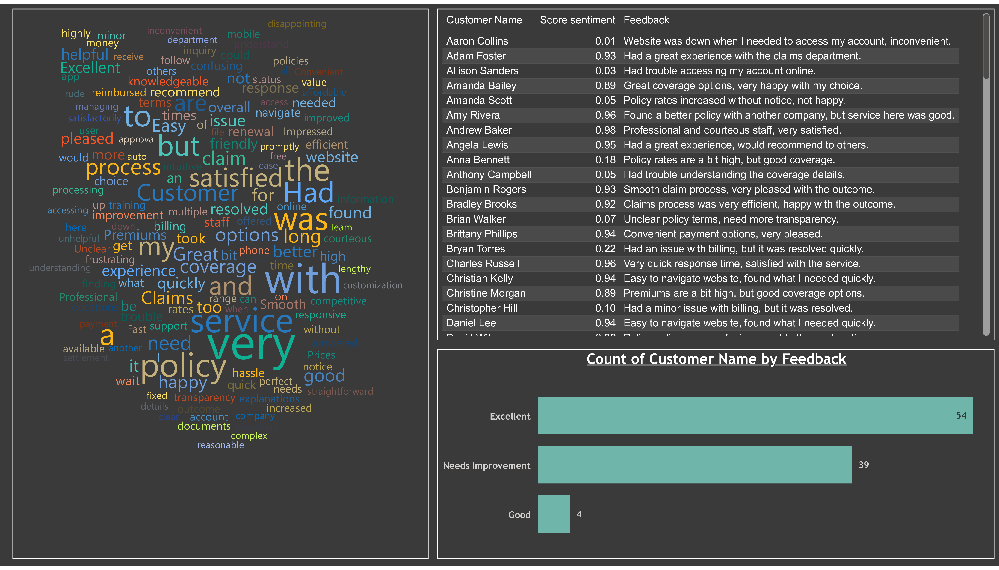

# 📊 Prism Insurance Dashboard – Power BI Project

This Power BI project presents an interactive dashboard built to analyze data from Prism Insurance Pvt. Ltd. It provides insights into customer policies, claim trends, and customer feedback using a clean visual design and advanced Power BI features.

---

## 🚀 Project Summary

- **Tools Used:** MS SQL Server, Power BI, Power Query, On-premises Gateway (Personal mode)
- **Core Skills Applied:** Data modeling, Data transformation, DAX measures, drill-through navigation, slicers, bookmarks, custom visuals
- **Dashboard Pages:**
  - 📄 **Page 1:** Key KPIs by Policy Type, Gender, Age Group, and Claim Status
  - 📄 **Page 2:** Drill-through Details per Customer Record
  - 📄 **Page 3:** Word Cloud Sentiment Analysis of Customer Feedback

---

## 📌 Key Features

- ✅ Connected and structured data in **MS SQL Server**
- ✅ Used **Power Query** to clean and transform data before reporting
- ✅ Integrated **drill-through functionality** between report pages
- ✅ Built a **Word Cloud chart** for visualizing customer sentiment
- ✅ Implemented **Slicers** and **Bookmarks** for an interactive experience
- ✅ Configured **Scheduled Refresh** using On-Premise Gateway (Personal Mode)
- ✅ Added **Row-Level Security (RLS)** using Manage Roles for policy types:
  - 🔐 `Health` Role – views only Health-related policies
  - 🔐 `Travel` Role – views only Travel-related policies

---

## 📊 Dashboard Snapshots

### 🔹 Page 1 – Overview


### 🔹 Page 2 – Drill-through Table View


### 🔹 Page 3 – Customer Feedback Analysis


---

## 📁 Project Structure

```bash
powerbi-prism-insurance-dashboard/
│
├── assets/                          # Screenshots
│   ├── Prism_Insurance_1_of_3.png
│   ├── Prism_Insurance_2_of_3.png
│   └── Prism_Insurance_3_of_3.png
│
├── pbix/                            # Power BI project file
│   └── Prism_Insurance.pbix
│
├── data/                            # Raw data files
│   ├── InsuranceData.csv
│   └── Insurance+Customer+Feedback.xlsx
│
├── README.md                        # Project overview (this file)
└── LICENSE                          # MIT License file

```
 
---

## 🔗 Project Link (Live Dashboard)

👉 [View the live dashboard in Power BI](https://app.powerbi.com/links/qmqhzuwrRP?ctid=6d600138-0932-49bd-951c-0d8382b1ee74&pbi_source=linkShare&bookmarkGuid=d5b08358-8be6-41cb-9555-55af5fe93e83)

---

## 📄 License

This project is licensed under the MIT License - see the [LICENSE](./LICENSE) file for details.

---
